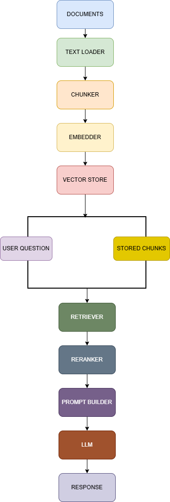

# RAG-From-Scratch

A modular Retrieval-Augmented Generation (RAG) system implemented from scratch using Hugging Face models with clean software architecture principles.

<p align="center">


</p>

---

## Architecture

<p align="center">



</p>

---

## Features

- Modular RAG architecture
- Multi-format document ingestion
- TXT, PDF, Markdown, and HTML loaders
- Recursive directory loading
- Token-based chunking
- Hugging Face sentence embeddings
- Brute-force vector search
- Cross-Encoder reranking
- Prompt construction
- Hugging Face LLM integration
- Source references in answers
- Dependency Injection architecture
- Easily extensible design

---

## Project Structure

```text
RAG-From-Scratch
│
├── data/
│   └── documents/
│
├── embeddings/
├── generation/
├── images/
├── ingestion/
│   ├── text_loader.py
│   ├── pdf_loader.py
│   ├── markdown_loader.py
│   ├── html_loader.py
│   ├── directory_loader.py
│   └── loader_factory.py
│
├── llm/
├── models/
├── pipeline/
├── retrieval/
├── tokenization/
├── vector_store/
│
├── config.py
├── main.py
├── requirements.txt
└── README.md
```

---

## Installation

Clone the repository:

```bash
git clone https://github.com/Kutlay07/RAG-From-Scratch.git

cd RAG-From-Scratch
```

Install dependencies:

```bash
pip install -r requirements.txt
```

---

## Usage

1. Add your documents into:

```text
data/documents/
```

Supported formats:

```text
.txt
.pdf
.md
.html
```

2. Configure models and parameters:

```python
config.py
```

3. Run:

```bash
python main.py
```

---

## Current Pipeline

```text
Documents
    ↓
Loader Factory
    ↓
Document Loader
    ↓
Chunker
    ↓
Embedder
    ↓
Vector Store
    ↓
Retriever
    ↓
Cross Encoder Reranker
    ↓
Prompt Builder
    ↓
LLM
    ↓
Response + Sources
```

---

## Roadmap

### v1.0 ✅

- End-to-end RAG pipeline
- Hugging Face embeddings
- Cross Encoder reranking
- Brute-force vector store

### v1.1 ✅

- Recursive directory ingestion
- Progress tracking
- Document statistics
- Source references

### v1.2 ✅

- PDF Loader
- Markdown Loader
- HTML Loader
- Loader Factory
- Multi-format document ingestion

### v1.3 🚧

- FAISS Vector Store
- Embedding cache
- Persistent vector database

### v1.4

- Streaming responses
- Better prompt templates
- Metadata filtering

### v2.0

- Hybrid Search
- Conversation Memory
- Evaluation Pipeline
- Agentic RAG

---

## Tech Stack

- Python
- PyTorch
- Hugging Face Transformers
- Sentence Transformers
- tiktoken

---

## License

This project currently does not include a license.